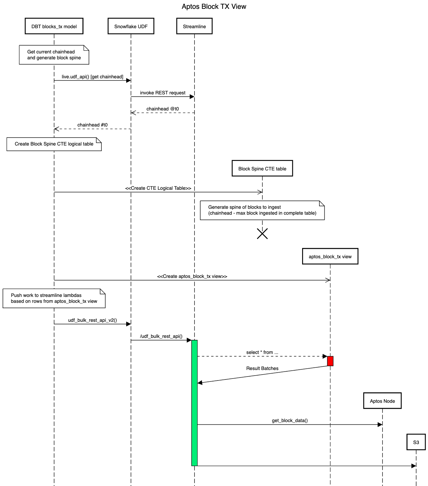

# Data Science Models - Quantum POC

This repo is a fork of the [FlistsideCrypto/xyz-models](https://github.com/FlipsideCrypto/xyz-models) repo, the `xyz-models` repo holds scafolding for DBT projects at `Flipside Crypto`.  This repo is intended to be used as a `POC` for showcasing the capabilities of using `Quantum Models` with a `streamine` backend wherein a single `DBT` model can be used for both `pull` and `push` based workloads. 

## DBT Profile Set Up

Use the following template to set up your `~/.dbt/profiles.yml` file:

```yml
datascience:
  target: dev
  outputs:
    dev:
      type: snowflake
      account: <ACCOUNT>
      role: <ROLE>
      user: <USERNAME>
      password: <PASSWORD>
      region: <REGION>
      database: DATASCIENCE_DEV
      warehouse: DBT_CLOUD
      schema: silver
      threads: 4
      client_session_keep_alive: False
      query_tag: <TAG>
```

### Project setup

This project has been setup with `fsc_utils` `v1.21.7` according to the instructions in the [fsc_utils setup](https://github.com/FlipsideCrypto/fsc-utils?tab=readme-ov-file#adding-the-fsc_utils-dbt-package) documentation. In addition `livequery` & `livequery marketplace GHA` models, schemas & functions have also been deployed to the `DATASCIENCE_DEV` database as per the instructions in the [livequery setup](https://github.com/FlipsideCrypto/fsc-utils?tab=readme-ov-file#livequery-functions) & [snowflake GHA tasks setup](https://github.com/flipsideCrypto/fsc-utils?tab=readme-ov-file#snowflake-tasks-for-github-actions) documentations.

### Understanding the `POC` quantum model

#### Bronze Layer

The [streamline__aptos_blocks_tx](/models/streamline/quantum/poc/core/streamline__aptos_blocks_tx.sql) model follows the design pattern of a `fsc` `streamline` dbt model for ingesting data from a blockchain node, in this case an `Aptos Node`. It uses a reusable [ephemeral dbt model](/models/streamline/quantum/poc/core/streamline__aptos_blocks_tx_ephemeral.sql) that is designed to fetch data from the `Aptos Node API` endpoint for specific block heights that have not been fetched yet. Here's what the reusable ephemeral model does in more detail:

[`node_calls` CTE](/models/streamline/quantum/poc/core/streamline__aptos_blocks_tx_ephemeral.sql#L6): This `CTE` generates `REST` request `URLs` for the `Aptos Node API` endpoint based on block heights that have not been fetched yet. It does this by comparing the `block_number` from the `streamline__aptos_blocks` table and the `block_number` from the `aptos.streamline.complete_blocks_tx` table. The `EXCEPT` clause returns all `block_number` values that are in the `streamline__aptos_blocks` table (generated by usling a `livequery` call to get the block height at chainhead) but not in the `aptos.streamline.complete_blocks_tx` table. These are the block heights that have not been fetched yet. For each of these block heights, it generates a `REST` request `URL` and stores it in the `calls` column.

[Final SELECT Statement](/models/streamline/quantum/poc/core/streamline__aptos_blocks_tx_ephemeral.sql#L26): This statement fetches data from the API endpoint for each `REST` request URL generated in the `node_calls` CTE. It does this by calling the `live.udf_api` function with the `GET` method and the `calls` URL. The `live.udf_api` function is expected to return the response from the API endpoint. The final result includes the current timestamp as `created_at` and `_inserted_timestamp`, the `block_height` rounded to the nearest thousand as `partition_key`, and the API response as request.

**Note** When this model is run in `streamline` mode, based on the observer (i.e. the Snowflake `user` invoking the model being `aws_lambda_*`) the calls to the `Aptos Node API` are distributed to ` streamline AWS Lambda's` that flush the responses to the appropirate Snowflake external tabes. See the [streamline architecture overview](https://github.com/flipsideCrypto/streamline?tab=readme-ov-file#architecture-overview) for more details.


#### Sequence Diagram for the Bronze Layer Model



**NOTE:** This model is intended to always run in `streamline mode` as it's purpose is to batch ingest data from the `Aptos Node`, as such being a quantum model, the mode is set based on who the "observer" is( in this case the `user` invoking the `livequery` AWS lambda ). Since this model is not schedule to run on a GHA cron, we spoof the user by setting the the user for this model through the a `dbt pre-hook` to set the session based context in the [dbt_project.yml file here](/dbt_project.yml#L40-47).

##### Invoking the bronze model

There is a make directive for invoking the bronze model. To invoke the model, ensure you have your `~/.dbt/profiles.yml` setup according to the [profile setup](#profile-setup) instructions and run the following make command:

```sh
make bronze
```
To view the work being "pushed" to the `streamline` backend for ingesting data from the `Aptos Node API` in `streamline` mode, run the following SQL query:

```sql
-- Set the snowflake console session context to the user invoking table
SET LIVEQUERY_CONTEXT = '{"userId":"aws_lambda_datascience_api"}';

SELECT * FROM DATASCIENCE_DEV.STREAMLINE.APTOS_BLOCKS_TX;

```
 **Note:** If you run the query above without setting the `LIVEQUERY_CONTEXT` session variable, you will be setting this to be run in `livequery` mode, wherein all the data will be fetched from the `Aptos Node API` in a single call and not distributed to the `streamline` backend but retrieved live.

To view the results of the model (the work "pushed" to a streamline backend), run the following SQL query:

```sql
SELECT * FROM STREAMLINE.DATASCIENCE_DEV.QUANTUM_POC_APTOS_BLOCKS_TX;
```


#### Silver Layer

Invoking `make silver` will run the `POC` quantum dbt [silver__blocks](/models/streamline/quantum/poc/silver/silver__blocks.sql) model. 


### Quantum Synergy

Once the `make silver` invocation is complete, this resulting `datascience_dev.silver__blocks` view will contain all the data from the `Aptos Node API` calls from the bronze layer and the delta `block_heights` that were not present at the time of model invocation in the `aptos.streamline.complete_blocks_tx` table pulled in via the `quantum state` livequery mode.

```sql 
SELECT * FROM DATASCIENCE_DEV.SILVER.BLOCKS;
```

### Enabling batching for Quantum models

When in `livequery` mode, you can enable batching for your quantum models by setting the [MAX_BATCH_ROWS](https://docs.snowflake.com/en/sql-reference/sql/create-external-function) param for the `live.udf_api` function. This will allow you to control the number of rows that are sent to the `livequery` backend via the `_live.udf_api` UDF.

This UDF is installed a part of the [livequery setup](https://github.com/FlipsideCrypto/fsc-utils?tab=readme-ov-file#livequery-functions). The default behaivor for `livequery function` setup is not to set `MAX_BATCH_ROWS` for the `live.udf_api` function. When it is not set Snowflake estimates the optimal batch size and uses that, this can cause timeouts from the livequery backend if the result set rows are too large to process for a AWS LAMBA.

To set the `MAX_BATCH_ROWS` for the `live.udf_api` function, you can run the following SQL command:

```sql
CREATE OR REPLACE EXTERNAL FUNCTION DATASCIENCE_DEV._LIVE.UDF_API("METHOD" VARCHAR(16777216), "URL" VARCHAR(16777216), "HEADERS" OBJECT, "DATA" VARIANT, "USER_ID" VARCHAR(16777216), "SECRET" VARCHAR(16777216))
RETURNS VARIANT
STRICT
API_INTEGRATION = "AWS_DATASCIENCE_API_STG"
MAX_BATCH_ROWS = 2
HEADERS = ('fsc-compression-mode' = 'auto')
AS 'https://65sji95ax3.execute-api.us-east-1.amazonaws.com/stg/udf_api';
```
**NOTE:** You can also set `fsc-compression-mode` to `auto, always or never` to activate compresssion of the resposne payload, this will affect response time as it adds computation.  


### Tuning Streamline Models

For more details on using the `udf params` used in streamline mode `post_hooks` refer to the following: 
 - [Lessons learned tuning backfills ](https://github.com/FlipsideCrypto/streamline-flow/discussions/10#discussioncomment-7194378)  
 - [Optimizing backfill tuning Streamline models](https://flipsidecrypto.slack.com/docs/T6F1AJ69E/F05V71L3ZJS)
 - [Streamline architecture overview](https://github.com/flipsideCrypto/streamline?tab=readme-ov-file#architecture-overview) 

### Resources:

- Learn more about dbt [in the docs](https://docs.getdbt.com/docs/introduction)
- Check out [Discourse](https://discourse.getdbt.com/) for commonly asked questions and answers
- Join the [chat](https://community.getdbt.com/) on Slack for live discussions and support
- Find [dbt events](https://events.getdbt.com) near you
- Check out [the blog](https://blog.getdbt.com/) for the latest news on dbt's development and best practices

## DBT Model Versioning

We use [dbt model versioning](https://docs.getdbt.com/docs/collaborate/govern/model-versions) to enable multiple versions of a model to be maintained for the incremental scores models. 

All the onchain [scores models](/models/gold/onchain_scores/) are suffixed with the version, to create a new version of a model:

- Create a new file with the new version number as the suffix, e.g. `onchain_scores__<CHAIN>_v2.sql` **NOTE** FSC DBT repos all use a [custom macro](/macros/create_latest_version_view.sql) to extract the schema name from the model name, the schema name is everything before the first `__` in the model name.
- Update the [config.alias](/models/gold/onchain_scores/onchain_scores_avalanche_properties.yml#L23) attribute in the [model properties](https://docs.getdbt.com/reference/model-properties) file to point to the new version of the model.
- Update the `version` [model config](/models/gold/onchain_scores/onchain_scores__avalanche_v2.sql#L6) in the new model file, this gets string interpolated to a column in the [table](/models/gold/onchain_scores/onchain_scores__avalanche_v2.sql#L368) as `score_version` on incremental runs of the model.

### Onchain Scores 

The final `onchain_scores` table generated by the dbt model will have the following structure:


| id | blockchain | score_version | user_address | calculation_time | score_date | total_score | activity_score | tokens_score | defi_score | nfts_score | gov_score |
|----|------------|---------------|--------------|------------------|------------|-------------|----------------|--------------|------------|------------|-----------|
| 1  | avalanche  | v1            | addr1        | 2022-01-01 00:00 | 2022-01-01 | 100         | 20             | 30           | 10         | 20         | 20        |
| 2  | avalanche  | v1            | addr2        | 2022-01-01 00:00 | 2022-01-01 | 90          | 10             | 20           | 20         | 20         | 20        |
| 3  | avalanche  | v2            | addr1        | 2022-01-02 00:00 | 2022-01-02 | 110         | 30             | 30           | 20         | 20         | 10        |


Here's how you can slice and dice this table based on `score_version`, `id`, and `calculation_time`:

`score_version`: This field represents the version of the score calculation. You can filter or group by this field to compare different versions of the score calculation. For example, you can compare the average total_score for each score_version:

```sql
SELECT score_version, AVG(total_score) AS avg_total_score
FROM avalanche
GROUP BY score_version;
```

`id`: This field is a surrogate key generated from the user_address, blockchain, and score_date fields. You can use this field to uniquely identify each row in the table. For example, you can get the total_score for a specific id:

```sql
SELECT total_score
FROM avalanche
WHERE id = 1;
```

`calculation_time`: This field represents the timestamp when the score was calculated. You can filter or group by this field to analyze the scores over time. For example, you can get the maximum `total_score` for each day:

```sql
SELECT DATE(calculation_time) AS date, MAX(total_score) AS max_total_score
FROM avalanche
GROUP BY date;
```


## Applying Model Tags

### Database / Schema level tags

Database and schema tags are applied via the `add_database_or_schema_tags` macro.  These tags are inherited by their downstream objects.  To add/modify tags call the appropriate tag set function within the macro.

```
{{ set_database_tag_value('SOME_DATABASE_TAG_KEY','SOME_DATABASE_TAG_VALUE') }}
{{ set_schema_tag_value('SOME_SCHEMA_TAG_KEY','SOME_SCHEMA_TAG_VALUE') }}
```

### Model tags

To add/update a model's snowflake tags, add/modify the `meta` model property under `config`.  Only table level tags are supported at this time via DBT.

```
{{ config(
    ...,
    meta={
        'database_tags':{
            'table': {
                'PURPOSE': 'SOME_PURPOSE'
            }
        }
    },
    ...
) }}
```

By default, model tags are not pushed to snowflake on each load.  You can push a tag update for a model by specifying the `UPDATE_SNOWFLAKE_TAGS` project variable during a run.

```
dbt run --var '{"UPDATE_SNOWFLAKE_TAGS":True}' -s models/core/core__fact_swaps.sql
```

### Querying for existing tags on a model in snowflake

```
select *
from table(datascience.information_schema.tag_references('datascience.core.fact_blocks', 'table'));
```
